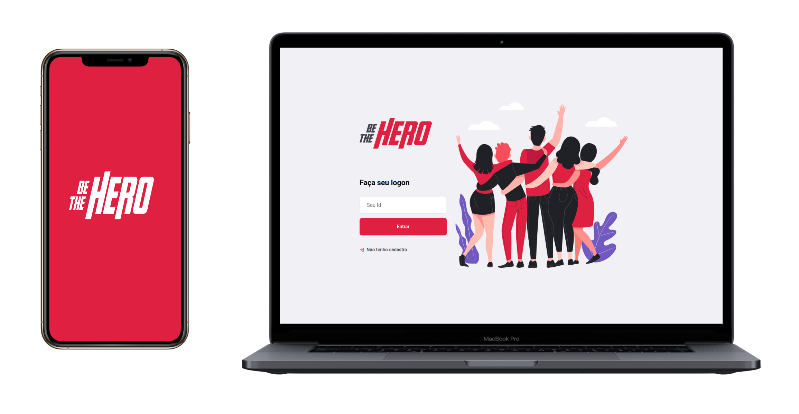
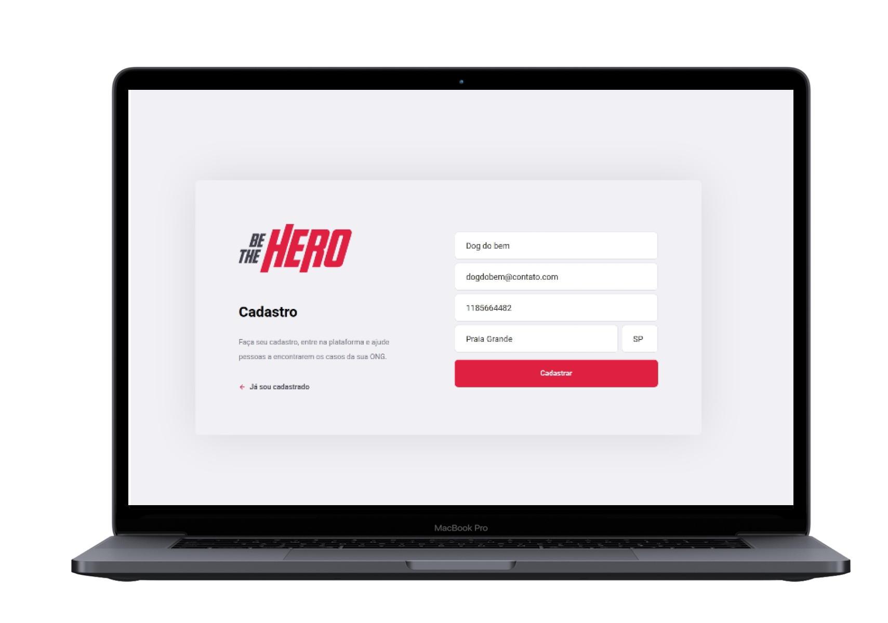
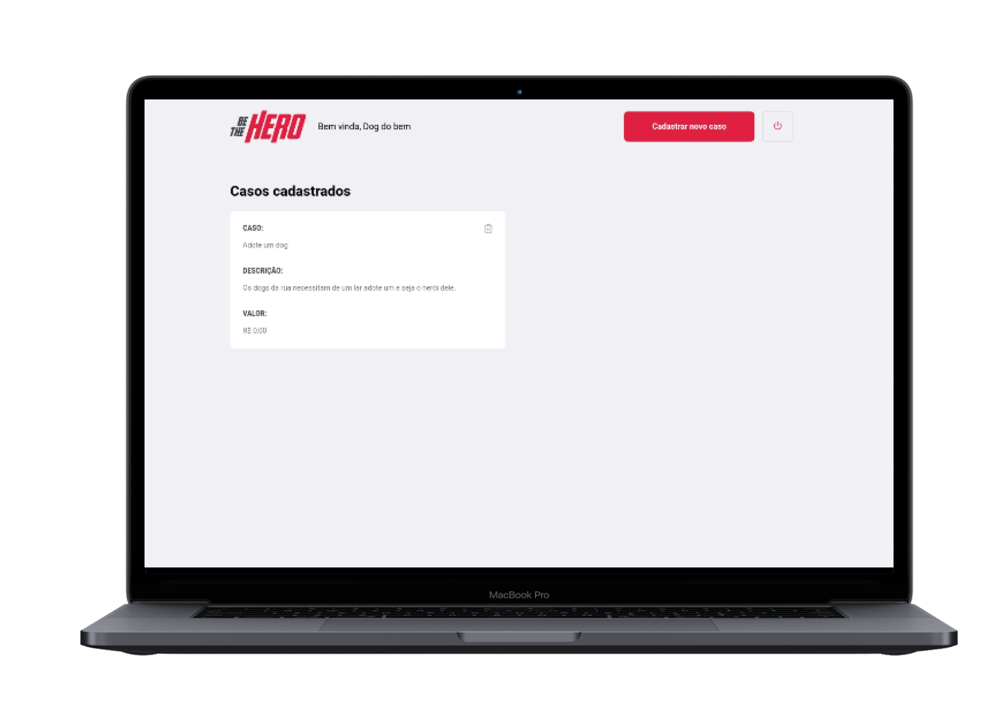

<h1 align="center">
    
</h1>

<p align="center">
  
</p>

<h4 align="center">
  🚀 Semana OmniStack 11.0
</h4>

<p align="center">
<a href="#telescope-projeto">🔭  Projeto</a>&nbsp;&nbsp;&nbsp;|&nbsp;&nbsp;&nbsp
<a href="#computer-tecnologias"> 💻  Tecnologias</a>&nbsp;&nbsp;&nbsp;|&nbsp;&nbsp;&nbsp;
<a href="#-preview">💜  Preview</a>&nbsp;&nbsp;&nbsp;|&nbsp;&nbsp;&nbsp;
<a href="#-getting-started">🤠  Getting Started </a>

</p>

## :telescope: Projeto

<b>Be The Hero</b> foi a aplicação desenvolvida durante a Semana OmniStack 11, evento realizado pela [Rocketseat](https://rocketseat.com.br/), nesta edição desenvolvemos uma aplicação onde o intuito é ajudar as ONGs divulgarem os casos que necessitam de uma ajuda financeira através de uma aplicação web, interessado conseguem ver os casos publicados via o app, e caso sinta a vontade de ajudar existem links que facilitam a comunicação redirecionando para o whatsApp ou o e-mail.

## :computer: Tecnologias

**:satellite: Backend**

- [NodeJs;](https://nodejs.org/en/)
- [Express;](https://www.express.com/)
- [Socket-io;](https://socket.io/)
- [SqLite;](https://www.sqlite.org/index.html)
- [Knex;](http://knexjs.org/)
- [Jest.](https://jestjs.io/pt-BR/)

**:computer: Frontend**

- [React Js;](https://pt-br.reactjs.org/)
- [Styled-Components;](https://styled-components.com/)
- [Axios.](https://github.com/axios/axios)

**:iphone: Mobile**

- [React Native;](https://facebook.github.io/react-native/)
- [Expo;](https://expo.io/)
- [Axios;](https://github.com/axios/axios)

## 💜 Preview

<p align="center">
  
</p>

<p align="center">
  
</p>

<p align="center">
  
</p>

## 🤠 Getting Started

Você precisa clonar o repositório e pode fazer isso digitando em seu terminal `$ git clone https://github.com/Luuck4s/Be-The-Hero.git`.

### :satellite: Backend

Logo após clonar o repositório navegue ate a pasta backend `$ cd backed/` e execute o comando `yarn install` ou `npm install`.

Após as dependências terminarem de instalar execute `$ npx knex migrate:latest` , isso ira executar as migrations necessárias para criar o banco de dados.

Logo após seguir tudo que foi feito acima pode executar o comando `yarn start` ou `npm start` e deverá aparecer algo parecido com essa mensagem:

```
[SERVER] Server is running on  http://localhost:3333
```

> O fronted e o mobile necessita do backend funcionando para ter seu funcionamento normal!

### :computer: Frontend

Após seguir os passos acima e o backend estiver funcionando vá para pasta `$ cd frontend/` e execute `yarn install` ou `npm install`.

Depois das dependências terminarem de instalar execute o comando `yarn start` ou `npm run start`.

### :iphone: Mobile

Para executar o mobile entre na pasta `$ cd mobile/` e logo após o backend estiver funcionando, execute `yarn install` ou `npm install`.

Após as dependências terminarem de baixar execute `yarn start` ou `npm start` e ai o expo já estará funcionando para você ler o Qr Code e utilizar a aplicação.
